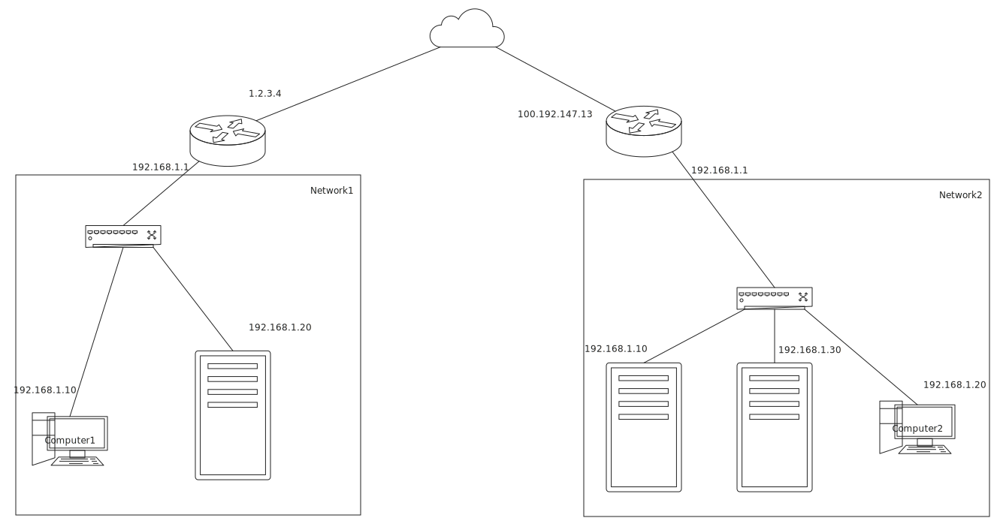

## Rabbit proxy server

Author: Kang Lin <kl222@126.com>

- Project
  + Home: [https://kanglin.github.io/RabbitProxyServer](https://kanglin.github.io/RabbitProxyServer/)
  + Project main repository: [https://github.com/KangLin/RabbitProxyServer](https://github.com/KangLin/RabbitProxyServer)
    - Mirror:
      + sourceforge: https://sourceforge.net/projects/rabbitproxyserver/
      + gitlab: https://gitlab.com/kl222/RabbitProxyServer
  + [Mailing list](https://sourceforge.net/p/rabbitproxyserver/mailman/): <rabbitproxyserver-discuss@lists.sourceforge.net>

- Language:
  + [:cn: Chinese](README_zh_CN.md)
  
- Build status
  - 
  - 

### Introduction

Due to work reasons, it is often necessary to remotely control a host in another intranet from one intranet. For example, in the following figure: Computer 1 in network 1 accesses the server or computer 2 in network 2.

No relevant open source software was found on the Internet.
So I wrote [Rabbit Remote Control](https://github.com/KangLin/RabbitRemoteControl). 
In the process of writing, I encountered a problem of mutual access between two intranets.
For details, please see: https://github.com/KangLin/RabbitRemoteControl/issues/7.

Searching for related proxy software on the Internet, there are only proxy servers with public IPs, and no proxy servers without public IPs. So I wrote this software,
In order to solve the problem of mutual access between two internal networks without public IP. And this software implements [multiple protocols](#Supported-protocols) proxy service function.

### Donation
If this software is useful to you, or you like it, please donate and support the author. Thank you!

If it cannot be displayed, please open:
https://gitee.com/kl222/RabbitCommon/raw/master/Src/Resource/image/Contribute.png

### Download

Semantic Versioning: https://semver.org/lang/zh-CN/

+ Latest Release: 
  - 
  - 
  - 
+ Current version:
  - Windows: Supported WINDOWS 7 and later version
    + Install package： RabbitProxyServer_setup_v0.0.1.exe
      - [Download from Github](https://github.com/KangLin/RabbitProxyServer/releases/download/v0.0.1/RabbitProxyServer_setup_v0.0.1.exe)
      - [Download from sourceforge](https://sourceforge.net/projects/rabbitproxyserver/files/v0.0.1/RabbitProxyServer_setup_v0.0.1.exe/download)
    + No need to install package:RabbitProxyServer_windows_v0.0.1.zip
      - [Download from Github](https://github.com/KangLin/RabbitProxyServer/releases/download/v0.0.1/RabbitProxyServer_windows_v0.0.1.zip)
      - [Download from sourceforge](https://sourceforge.net/projects/rabbitproxyserver/files/v0.0.1/RabbitProxyServer_windows_v0.0.1.zip/download)
  - Ubuntu:
    + Ubuntu 20.04: rabbitproxyserver_0.0.1_amd64_Ubuntu-20.04.deb
      
          sudo apt install ./rabbitproxyserver_0.0.1_amd64_Ubuntu-20.04.deb
          
          # If you're on an older Linux distribution, you will need to run this instead:
          # sudo dpkg -i rabbitproxyserver_0.0.1_amd64_Ubuntu-20.04.deb
          # sudo apt-get install -f # Install dependencies

      - [Download from Github](https://github.com/KangLin/RabbitProxyServer/releases/download/v0.0.1/rabbitproxyserver_0.0.1_amd64_Ubuntu-20.04.deb)
      - [Download from sourceforge](https://sourceforge.net/projects/rabbitproxyserver/files/v0.0.1/rabbitproxyserver_0.0.1_amd64_Ubuntu-20.04.deb/download)
      
    + Ubuntu 18.04: rabbitproxyserver_0.0.1_amd64_Ubuntu-18.04.deb

          sudo apt install ./rabbitproxyserver_0.0.1_amd64_Ubuntu-18.04.deb
          
          # If you're on an older Linux distribution, you will need to run this instead:
          # sudo dpkg -i rabbitproxyserver_0.0.1_amd64_Ubuntu-18.04.deb
          # sudo apt-get install -f # Install dependencies

      - [Download from Github](https://github.com/KangLin/RabbitProxyServer/releases/download/v0.0.1/rabbitproxyserver_0.0.1_amd64_Ubuntu-18.04.deb)
      - [Download from sourceforge](https://sourceforge.net/projects/rabbitproxyserver/files/v0.0.1/rabbitproxyserver_0.0.1_amd64_Ubuntu-18.04.deb/download)

### Supported protocols

- Socks protocol
  - [x] SOCKS Protocol Version 4: 
    + socks4:
      - https://www.openssh.com/txt/socks4.protocol
      - https://github.com/tsaooo/Socks4-proxy-server/blob/master/NP_Project4_Spec.pdf    
      - https://en.wikipedia.org/wiki/SOCKS#SOCKS4
    + [x] socks4a:
      - https://www.openssh.com/txt/socks4a.protocol
      - https://en.wikipedia.org/wiki/SOCKS#SOCKS4a
  - [x] SOCKS Protocol Version 5 (RFC1928)：http://www.ietf.org/rfc/rfc1928.txt
    + [x] Username/Password Authentication for SOCKS V5: https://www.ietf.org/rfc/rfc1929.txt
  - [ ] SOCKS Protocol Version 6: https://datatracker.ietf.org/doc/draft-olteanu-intarea-socks-6/
- Http protocols
  + [ ] [Hypertext Transfer Protocol (HTTP/1.1): Message Syntax and Routing](https://datatracker.ietf.org/doc/html/rfc7230)
  + [ ] Tunneling TCP based protocols through Web proxy servers: https://datatracker.ietf.org/doc/html/draft-luotonen-web-proxy-tunneling-01
  + [ ] [Hypertext Transfer Protocol (HTTP/1.1): Semantics and Content](https://datatracker.ietf.org/doc/html/rfc7231#section-0.0.1)
- Custom protocol
    + [x] Custom protocol for ICE：[Src/PeerConnecterIceClient.h](Src/PeerConnecterIceClient.h#L63)
    
### Development
#### Dependent
##### Tools
- [x] [Qt](qt.io)
- [x] c compiler
  + gcc
  + MSVC
- [cmake](https://cmake.org/)

##### libraries

- [Optional] libdatachannel: https://github.com/paullouisageneau/libdatachannel
