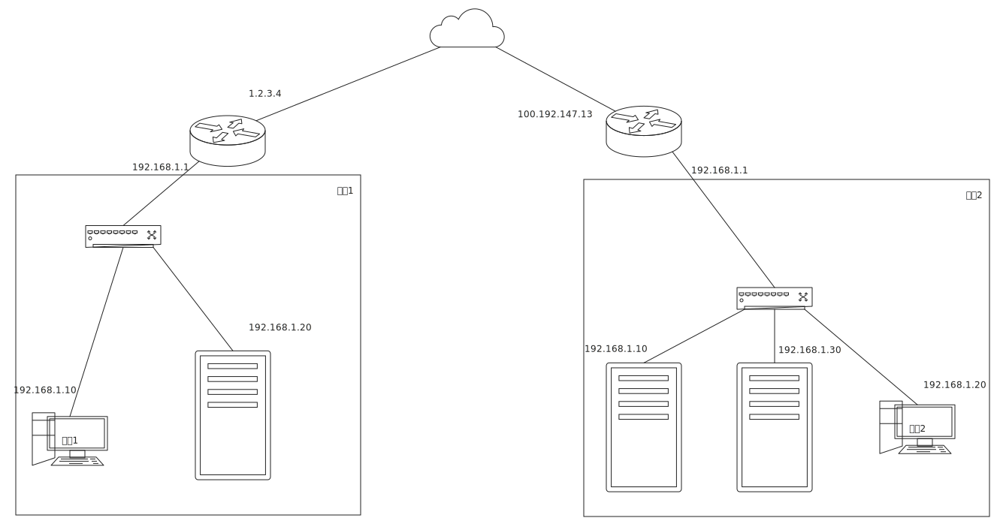

## 玉兔代理服务器
作者: 康林 <kl222@126.com>

- 项目
  + 主页：[https://kanglin.github.io/RabbitProxyServer](https://kanglin.github.io/RabbitProxyServer)
  + 代码主仓库：[https://github.com/KangLin/RabbitProxyServer](https://github.com/KangLin/RabbitProxyServer)
    - 镜像：
      + sourceforge: https://sourceforge.net/projects/rabbitproxyserver/
      + gitlab: https://gitlab.com/kl222/RabbitProxyServer
  + [邮件列表](https://sourceforge.net/p/rabbitproxyserver/mailman/)：<rabbitproxyserver-discuss@lists.sourceforge.net>
    
- 语言
  + [:us: 英语](README.md)
- 编译状态
  - 
  - 

### 简介

因为工作原因，需要经常从一个内网远程控制另一个内网中的主机。例如下图中：网络1中的电脑1访问网络2中的服务器或电脑2。

在网上没有查找到相关的开源软件。
所以着手写了[玉兔远程控制](https://github.com/KangLin/RabbitProxyServer)。在写的过
程遇到了两个内网互相访问的问题，详见：https://github.com/KangLin/RabbitProxyServer/issues/7 。

在网上查找相关的代理软件，只有有公网IP的代理服务器，并没有无公网IP的代理服务器。所以写了本软件，
以解决两个无公网IP的内网互相访问的问题。并且本软件实现[多种协议](#支持的协议)代理服务功能。

### 捐赠
本软件如果对你有用，或者你喜欢它，请你捐赠，支持作者。谢谢！

如果不能显示，请打开：
https://gitee.com/kl222/RabbitCommon/raw/master/Src/Resource/image/Contribute.png

### 下载

版本号说明： https://semver.org/lang/zh-CN/

+ 最后发行版本：
  - 
  - 
  - 
+ 当前版本：
  - Windows: 支持 WINDOWS 7 及以后版本
    + 安装包：RabbitProxyServer_setup_v0.0.1.exe
      - [从 github 下载](https://github.com/KangLin/RabbitProxyServer/releases/download/v0.0.1/RabbitProxyServer_setup_v0.0.1.exe)
      - [从 sourceforge 下载](https://sourceforge.net/projects/rabbitproxyserver/files/v0.0.1/RabbitProxyServer_setup_v0.0.1.exe/download)
    + 绿色版本：RabbitProxyServer_windows_v0.0.1.zip
      - [从 github 下载](https://github.com/KangLin/RabbitProxyServer/releases/download/v0.0.1/RabbitProxyServer_windows_v0.0.1.zip)
      - [从 sourceforge 下载](https://sourceforge.net/projects/rabbitproxyserver/files/v0.0.1/RabbitProxyServer_windows_v0.0.1.zip/download)
  - Ubuntu:
    + Ubuntu 20.04: rabbitproxyserver_0.0.1_amd64_Ubuntu-20.04.deb
      
          sudo apt install ./rabbitproxyserver_0.0.1_amd64_Ubuntu-20.04.deb
          
          # 如要你是在老的 linux 发行版本上，你需要用下列命令替换：
          # sudo dpkg -i rabbitproxyserver_0.0.1_amd64_Ubuntu-20.04.deb
          # sudo apt-get install -f # 安装依赖

      - [从 github 下载](https://github.com/KangLin/RabbitProxyServer/releases/download/v0.0.1/rabbitproxyserver_0.0.1_amd64_Ubuntu-20.04.deb)
      - [从 sourceforge 下载](https://sourceforge.net/projects/rabbitproxyserver/files/v0.0.1/rabbitproxyserver_0.0.1_amd64_Ubuntu-20.04.deb/download)
      
    + Ubuntu 18.04: rabbitproxyserver_0.0.1_amd64_Ubuntu-18.04.deb

          sudo apt install ./rabbitproxyserver_0.0.1_amd64_Ubuntu-18.04.deb
          
          # 如要你是在老的 linux 发行版本上，你需要用下列命令替换：
          # sudo dpkg -i rabbitproxyserver_0.0.1_amd64_Ubuntu-18.04.deb
          # sudo apt-get install -f # 安装依赖

      - [从 github 下载](https://github.com/KangLin/RabbitProxyServer/releases/download/v0.0.1/rabbitproxyserver_0.0.1_amd64_Ubuntu-18.04.deb)
      - [从 sourceforge 下载](https://sourceforge.net/projects/rabbitproxyserver/files/v0.0.1/rabbitproxyserver_0.0.1_amd64_Ubuntu-18.04.deb/download)

### 支持的协议

- Socks 代理协议
  - [x] SOCKS 协议版本 4: 
    + socks4:
      - https://www.openssh.com/txt/socks4.protocol
      - https://github.com/tsaooo/Socks4-proxy-server/blob/master/NP_Project4_Spec.pdf
      - https://en.wikipedia.org/wiki/SOCKS#SOCKS4
    + [x] socks4a:
      - https://www.openssh.com/txt/socks4a.protocol
      - https://en.wikipedia.org/wiki/SOCKS#SOCKS4a
  - [x] SOCKS 协议版本 5(RFC1928)：http://www.ietf.org/rfc/rfc1928.txt
    + [x] Socks5 用户名/密码验证协议: https://www.ietf.org/rfc/rfc1929.txt
  - [ ] SOCKS 协议版本 6: https://datatracker.ietf.org/doc/draft-olteanu-intarea-socks-6/
- Http 代理协议
  + [ ] [Hypertext Transfer Protocol (HTTP/1.1): Message Syntax and Routing](https://datatracker.ietf.org/doc/html/rfc7230)
  + [ ] Tunneling TCP based protocols through Web proxy servers: https://datatracker.ietf.org/doc/html/draft-luotonen-web-proxy-tunneling-01
  + [ ] [Hypertext Transfer Protocol (HTTP/1.1): Semantics and Content](https://datatracker.ietf.org/doc/html/rfc7231#section-0.0.1)
- 自定义协议
  + [x] 用于ICE的自定义协议：[Src/PeerConnecterIceClient.h](Src/PeerConnecterIceClient.h#L63)
  
### 参考文档

- socket5的实现--(RFC1928)Socket5协议中文文档: https://www.cnblogs.com/xi-jie/articles/10476545.html
- HTTP协议和SOCKS5协议: https://www.cnblogs.com/yinzhengjie/p/7357860.html
- HTTP 代理原理及实现（一）: https://imququ.com/post/web-proxy.html

### 开发
#### 依赖
##### 工具
- [x] [Qt](qt.io)
- [x] c compiler
  + gcc
  + MSVC
- [cmake](https://cmake.org/)

##### 库

- [可选] libdatachannel: https://github.com/paullouisageneau/libdatachannel
